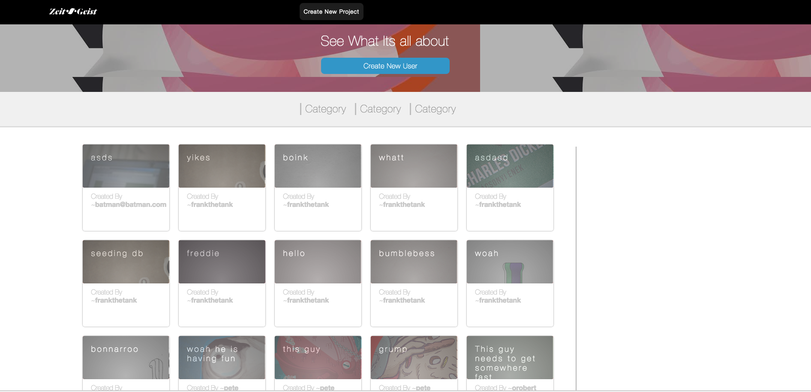

# Zeit-Geist #

## *A Portfolio Sharing Website and Behance Clone, which allows users to create and Share Portfolio Pieces. It is a Fullstack Web App using a Rails backend, Postrgesql database, React.js/Flux frontend architecture*
###Single Page App
Zeit-Geist is a single page App that renders to the DOM using a single element. This allows for a more fluid User Experience. Zeit-Geist implements front-end User Authentication and a FLUX cycle that rerenders the DOM content based on a Users Sign in status.
###Projects
The Project Index Page shows a feed of the Twenty most recently posted projects. When a User clicks on a Project, they are directed to that Project's page, where the site makes an API request to the backend, which queries the database for that project and all associated images and descriptions, and then sends that data back to the front-end which updates the content component's state and renders them in the correct order to the DOM.

 

###AWS
This Site uses AWS after Project Images are sent to the backend to store all Images as well as Custom User Authentication to update a users logged in status by setting and storing a users cookie hash.
###Cover Photos
The site also allows a user to select a cover image for a project as well as setting and storing its zoom and position coordinates.
###Infinite Scroll
The site also implements a custom Infinite scroll algorithms that pulls Ten Projects at a time from an index that keeps track of a users current start index within the project array and only returns the necessary amount of next projects.
